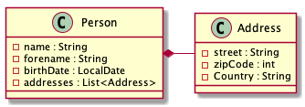
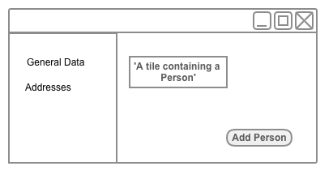
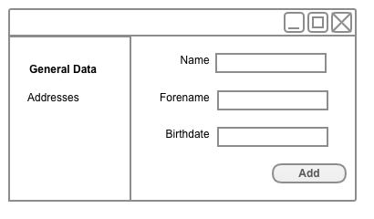
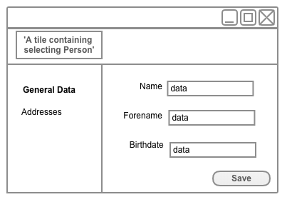
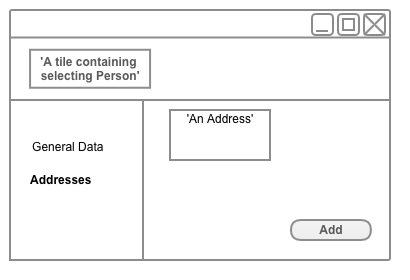
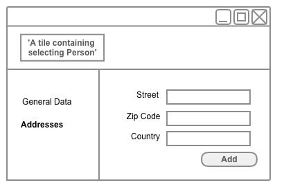

# NGXS Showcase #

This project demonstrate certain use of [NGXS](https://ngxs.gitbook.io/ngxs).

See the branch [ngxs2](https://github.com/McKratt/ngxs-showcase/tree/ngxs2) to see the showcase with Angular 5 and the version 2 of NGXS.
See the branch [ngxs3](https://github.com/McKratt/ngxs-showcase/tree/ngxs3) to see the showcase with Angular 6 and the version 3 of NGXS.

# Use Case #

## Model ##
Consider a person which can contain many addresses :

## Screens ##

* The index screen contain a button to add a new person and show all the already existing persons.

* Once we push the button to add a new person, we navigate to the screen __persons/new__.

* Once the button **Add** pressed, a new banner appear with the general info of the person inside. 
* We stay on the same screen but the url is now __persons/{id}__, where ID represent an internal automatically generated ID. 
* The button is no more **Add** but **Save**.
* In Case of modification, when the button **Save** is pushed the tile in the banner should be automatically updated.

 

* You can navigate to the addresses screen by clicking in the menu at left.
* You navigate then to __persons/{id}/addresses__ and you show all the existing addresses.

* Once the add button pressed we navigate to __persons/{id}/addresses/new__.

* Once the button Add pressed we navigate back to __persons/{id}/addresses__.
* The new address should be now visible in a tile.

### Optional ###
* Same behaviour if we want to modify an Address
  * Tile with the info of the current address
  * Button **Add** changed for **Save**
  * Automatic update when saved

## Non Functional Requirements ##

- We should use aot and have distinct js file for each module.
- The forms should have all their model in a [NGXS state](https://ngxs.gitbook.io/ngxs/concepts/state).
- Conditions should, most of the time, determined with [NGXS selector](https://ngxs.gitbook.io/ngxs/concepts/select).
- Angular Components don't communicate each other, they only interrogate the [store](https://ngxs.gitbook.io/ngxs/concepts/store).
