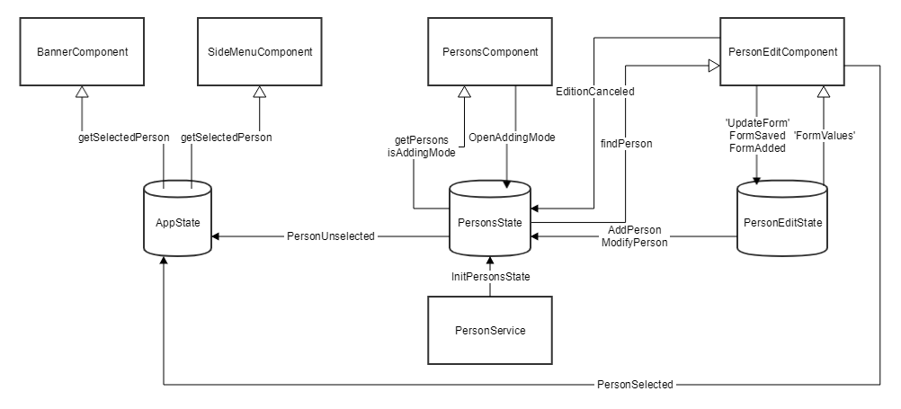

# NGXS Showcase #

This project demonstrate certain use of [NGXS](https://ngxs.gitbook.io/ngxs).

See the branch [ngxs2](https://github.com/McKratt/ngxs-showcase/tree/ngxs2) to see the showcase with Angular 5 and the version 2 of NGXS.
See the branch [ngxs3](https://github.com/McKratt/ngxs-showcase/tree/ngxs3) to see the showcase with Angular 6 and the version 3 of NGXS.

# Use Case #

## Model ##
Consider a person which can contain many addresses :


## Screens ##

* The index screen contain a button to add a new person and show all the already existing persons.


* Once we push the button to add a new person, we navigate to the screen __persons/new__.


* Once the button **Add** pressed, a new banner appear with the general info of the person inside. 
* We stay on the same screen but the url is now __persons/{id}__, where ID represent an internal automatically generated ID. 
* The button is no more **Add** but **Save**.
* In Case of modification, when the button **Save** is pushed the tile in the banner should be automatically updated.

 

* You can navigate to the addresses screen by clicking in the menu at left.
* You navigate then to __persons/{id}/addresses__ and you show all the existing addresses.


* Once the add button pressed we navigate to __persons/{id}/addresses/new__.


* Once the button Add pressed we navigate back to __persons/{id}/addresses__.
* The new address should be now visible in a tile.

### Optional ###
* Same behaviour if we want to modify an Address
  * Tile with the info of the current address
  * Button **Add** changed for **Save**
  * Automatic update when saved

## Non Functional Requirements

- We should use aot and have distinct js file for each module.
- The forms should have all their model in a [NGXS state](https://ngxs.gitbook.io/ngxs/concepts/state).
- Conditions should, most of the time, determined with [NGXS selector](https://ngxs.gitbook.io/ngxs/concepts/select).
- Angular Components don't communicate each other, they only interrogate the [store](https://ngxs.gitbook.io/ngxs/concepts/store).

# NGXS 2 Implementation details

## JEST

[jest-preset-angular](https://github.com/thymikee/jest-preset-angular)

### Install

```
yarn add -D jest jest-preset-angular
```

### Basic Configuration

**package.json**
```json
,
  "jest": {
    "preset": "jest-preset-angular",
    "setupTestFrameworkScriptFile": "<rootDir>/src/setupJest.ts"
  }
```
**setupJest.ts**
```typescript
import 'jest-preset-angular';
import './jestGlobalMocks'; // browser mocks globally available for every test
```

**jestGlobalMocks**
```typescript
global['CSS'] = null;

const mock = () => {
  let storage = {};
  return {
    getItem: key => key in storage ? storage[key] : null,
    setItem: (key, value) => storage[key] = value || '',
    removeItem: key => delete storage[key],
    clear: () => storage = {},
  };
};

Object.defineProperty(window, 'localStorage', {value: mock()});
Object.defineProperty(window, 'sessionStorage', {value: mock()});
Object.defineProperty(document, 'doctype', {
  value: '<!DOCTYPE html>'
});
Object.defineProperty(window, 'getComputedStyle', {
  value: () => {
    return {
      display: 'none',
      appearance: ['-webkit-appearance']
    };
  }
});
/**
 * ISSUE: https://github.com/angular/material2/issues/7101
 * Workaround for JSDOM missing transform property
 */
Object.defineProperty(document.body.style, 'transform', {
  value: () => {
    return {
      enumerable: true,
      configurable: true,
    };
  },
});
```
**typings.d.ts**
```typescript
declare var global: any;
```

### TestBed Optimization

**steupJest.ts**
```typescript
import './setupTestBed';
```

**setupTestBed.ts**
```typescript
import {TestBed, async, TestModuleMetadata} from '@angular/core/testing';

const resetTestingModule = TestBed.resetTestingModule,
  preventAngularFromResetting = () => TestBed.resetTestingModule = () => TestBed;

global.setupTestBed = (moduleDef: TestModuleMetadata) => {
  beforeAll(async(async () => {
    resetTestingModule();
    preventAngularFromResetting();
    TestBed.configureTestingModule(moduleDef);
    await TestBed.compileComponents();
  }));

  afterAll(() => resetTestingModule());
};
```

**typings.d.ts**
```typescript
declare namespace NodeJS {
  export interface Global {
    setupTestBed: any;
  }
}

declare var setupTestBed: any;

declare var beforeAll: any;
declare var afterAll: any;
```

## Angular Modules Lazy Loading

### Routes

**AppModule** parent
```typescript
const appRoutes: Routes = [
  {
    path: 'persons',
    loadChildren: './modules/persons/persons.module#PersonsModule'
  },
  ...
  ];

@NgModule({
 ...
  imports: [
    RouterModule.forRoot(appRoutes),
  ],
  ..
  })
export class AppModule {
}
```
**PersonModule** Child

```typescript
const personRoutes: Routes = [
  {
    path: '',
    component: PersonsComponent
  },
  {
    path: ':id',
    component: PersonEditComponent
  }
];

@NgModule({
  imports: [
    ...
    RouterModule.forChild(personRoutes),
    ...
  ],
  exports: [
    ...
    RouterModule
    ...
  ],

})
export class PersonsModule {
}
```

### Store

**AppModule** parent
```typescript
@NgModule({
  ...
  imports: [
    ...
    NgxsModule.forRoot([])
    ...
  ],
  ...
})
export class AppModule {
}
```

**PersonModule** child
```typescript
@NgModule({
  imports: [
    ...
    NgxsModule.forFeature([PersonsState]),
    ...
  ],
  ...
})
export class PersonsModule {
}
```

## Barrels & Paths

### Barrel
In _shared_ folder add **index.ts** file :
```typescript
export {MaterialModule} from './material/material.module';
export {
  SetFormDirty,
  SetFormDisabled,
  SetFormEnabled,
  SetFormPristine,
  UpdateForm,
  UpdateFormDirty,
  UpdateFormErrors,
  UpdateFormStatus,
  UpdateFormValue
} from './ngxs/actions';
export {NgxsFormPluginModule} from './ngxs/form.module';
export {MyNgxsFormDirective} from './ngxs/my-ngxs-form.directive';
export {NgxsFormPlugin} from './ngxs/form.plugin';

```
**IMPORTANT** : Angular Module need named export don't use the * to export your objects.

### Paths
In **tsconfig.json** add a path to the previous barrel :
```json
    "baseUrl": "src",
    "paths": {
      "@shared": ["app/shared/index"]
    },
```
**IMPORTANT** : to use path you have to define baseUrl as well.

In **package.json** add the path to _Jest_ so the tests know the paths too :

```json
    "moduleNameMapper": {
      "@shared": "<rootDir>/src/app/shared/index"
    }
```

Now you can import all the content of the shared folder with only _@shared_. Ex :
```typescript
import {MaterialModule, NgxsFormPluginModule} from '@shared'
```

# States, Actions and Selectors



# TODOs
- [ ] Refactor tests
- [x] do a Banner that show the person currently in edition
- [ ] addresses
- [ ] for addresses do a form of forms with inline edit mapped on one only state
- [ ] Improve barrels and aliases

